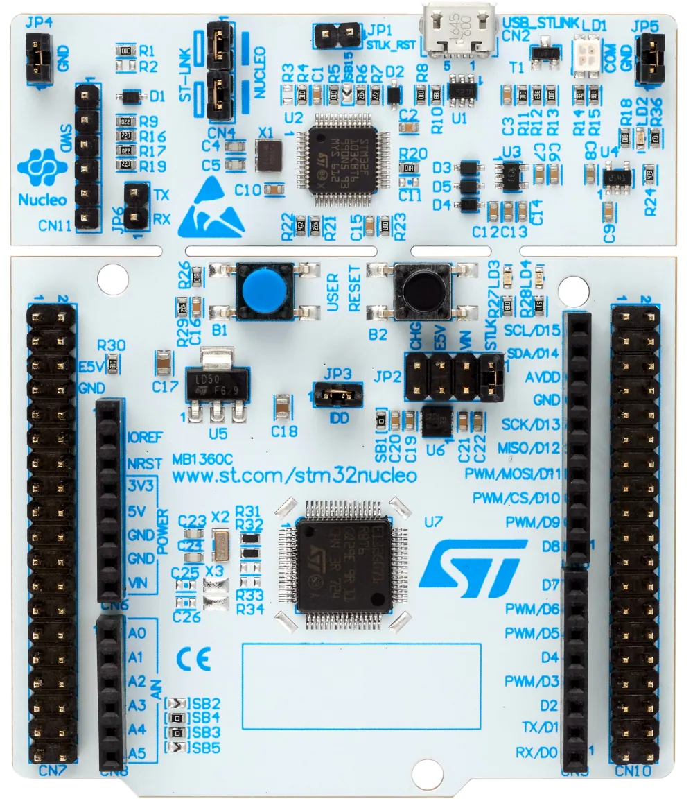

..
    Copyright 2023 MicroEJ Corp. All rights reserved.
    Use of this source code is governed by a BSD-style license that can be found with this software.

.. |BOARD_NAME| replace:: STM32G0B1RE
.. |BOARD_REVISION| replace:: MB1360-G0B1RE-C02
.. |RCP| replace:: MICROEJ SDK
.. |VEEPORT| replace:: VEE Port
.. |SIM| replace:: MICROEJ Simulator
.. |CIDE| replace:: MICROEJ SDK
.. |RTOS| replace:: Azure RTOS (ThreadX)
.. |MANUFACTURER| replace:: STMicroelectronics
.. |MICROEJ_ARCHITECTURE_VERSION| replace:: 8.0.0
.. |MICROEJ_SDK_VERSION| replace:: 23.07
.. |TOOLCHAIN| replace:: IAR Embedded Workbench for Arm
.. |TOOLCHAIN_VER| replace:: 8.50.9

.. _README BSP: ./stm32g0b1_threadx-bsp/projects/microej/README.rst
.. _RELEASE NOTES: ./RELEASE_NOTES.rst
.. _CHANGELOG: ./CHANGELOG.rst

==========================================
|VEEPORT| for |MANUFACTURER| |BOARD_NAME|
==========================================

.. image:: https://shields.microej.com/endpoint?url=https://repository.microej.com/packages/badges/sdk_5.8.json
   :alt: sdk_5.8 badge
   :align: left

.. image:: https://shields.microej.com/endpoint?url=https://repository.microej.com/packages/badges/arch_8.0.json
   :alt: arch_8.0 badge
   :align: left

This project is used to build a |VEEPORT| for the |BOARD_NAME|
development board.

Clone the repository with ``git clone --recursive https://github.com/MicroEJ/VEEPort-STMicroelectronics-STM32G0B1RE.git``.

Related Files
=============

This directory also contains:

* `CHANGELOG`_ to track the changes in the |BOARD_NAME| VEE Port
* `RELEASE NOTES`_ to list:

  - the supported hardware,
  - the known issues and the limitations,
  - the development environment,
  - the list of the dependencies and their versions.

* `README BSP`_ recommended for users familiar with the
  |MANUFACTURER| SDK/BSP and advanced usage on how to customize the build
  process.

Board Technical Specifications
==============================

.. list-table::

   * - Name
     - |BOARD_NAME|
   * - Revision
     - |BOARD_REVISION|
   * - MCU part number
     - NUCLEO-G0B1RE
   * - MCU revision
     - STM32G0B1RET6U
   * - MCU architecture
     - Cortex-M0+ 32-bit
   * - MCU max clock frequency
     - 64 MHz
   * - Internal flash size
     - 512 KB
   * - Internal RAM size
     - 144 KB SRAM
   * - External flash size
     - None
   * - External RAM size
     - None
   * - Power supply
     - Flexible: ST-LINK USB or external sources

Here is a list of |BOARD_NAME| useful documentation links:

- Board documentation available `here <https://www.st.com/en/evaluation-tools/nucleo-g0b1re.html#overview>`__
- |MANUFACTURER| board Getting Started available `here <https://www.st.com/en/evaluation-tools/nucleo-g0b1re.html#documentation>`__
- Board schematics available `here <https://www.st.com/en/evaluation-tools/nucleo-g0b1re.html#cad-resources>`__
- MCU Technical Reference Manual available `here <https://www.st.com/en/evaluation-tools/nucleo-g0b1re.html#documentation>`__
- MCU Datasheet available `here <https://www.st.com/en/microcontrollers-microprocessors/stm32g0b1re.html>`__
- MCU Errata available `here <https://www.st.com/resource/en/errata_sheet/es0548-stm32g0b1xbxcxe-device-errata-stmicroelectronics.pdf>`__

VEE Port Specifications
=======================

The Architecture version is |MICROEJ_ARCHITECTURE_VERSION|.

This VEE Port provides the following Foundation Libraries:

.. list-table::
   :header-rows: 1

   * - Foundation Library
     - Version
   * - EDC
     - 1.3
   * - BON
     - 1.4

The |VEEPORT| is derived into:

- a Mono-Sandbox |VEEPORT|

Requirements
============

- PC with Windows 10
- Internet connection to `MicroEJ Central Repository <https://developer.microej.com/central-repository/>`_
- |RCP| Dist. |MICROEJ_SDK_VERSION| or higher, available `here <https://developer.microej.com/microej-sdk-software-development-kit/>`_
- |BOARD_NAME| board

BSP Setup
=========

Install the |TOOLCHAIN| toolchain as described `here
<https://www.iar.com/products/architectures/arm/iar-embedded-workbench-for-arm/>`__.

Windows Toolchain
-----------------

- C/C++ toolchain name: |TOOLCHAIN| 
- C/C++ toolchain version: |TOOLCHAIN_VER|
- C/C++ toolchain `download link <https://www.iar.com/ewarm>`__

Please refer to the |MANUFACTURER| documentation available `here
<https://www.st.com/en/evaluation-tools/nucleo-g0b1re.html#documentation>`__
for more details.

BSP Compilation
---------------

The |VEEPORT| provides a pre-compiled Standalone Application.
Validate the BSP installation by compiling the BSP to build a |BOARD_NAME|
Firmware.

To build the ``stm32g0b1_threadx-bsp`` project, open a
terminal and enter the following command lines:

**On Windows:**

.. code-block:: sh

      $ cd "xxx/stm32g0b1_threadx-bsp/projects/microej/scripts"
      $ build.bat 

The BSP project build is launched. Please wait for the final message:

.. code-block::

      To flash all build output, run 'make flash' or:

The build script expects the toolchain to be installed at a known
path.  If you installed it elsewhere, see `README BSP`_ for
how to customize its path.

Please refer to `README BSP`_ for more details on how to
customize the build scripts.

Board Setup
===========

Please refer to the |MANUFACTURER| documentation available `here
<https://www.st.com/en/evaluation-tools/nucleo-g0b1re.html#documentation>`__
for more details.

Power Supply
------------

The STM32 Nucleo-64 board is designed to be powered by several DC power supplies. It is
possible to supply the STM32 Nucleo-64 board with any of the following sources:

- 5V_USB_STLK from the ST-LINK USB connector
- VIN (7 V - 12 V) from ARDUINO® connector or ST morpho connector
- E5V from ST morpho connector
- 5V_USB_CHG from the ST-LINK USB connector
- 3.3 V on ARDUINO® connector or ST morpho connector

Please refer to the |MANUFACTURER| documentation available `here
<https://www.st.com/resource/en/user_manual/um2324-stm32-nucleo64-boards-mb1360-stmicroelectronics.pdf>`__
for more details.

Programming
-----------

The |BOARD_NAME| board can be flashed following the steps below:

**On Windows:**

.. code-block:: sh

      $ cd "xxx/stm32g0b1_threadx-bsp/projects/microej/scripts"
      $ run.bat 

**On Linux / macOS:**

.. code-block:: sh

      $ cd "xxx/stm32g0b1_threadx-bsp/projects/microej/scripts"
      $ run.sh 

The firmware is launched. Please wait for the final message:

.. code-block::

     CSpyBat terminating.

|MANUFACTURER| build and flash documentation are also available `here
<https://www.st.com/resource/en/user_manual/um2324-stm32-nucleo64-boards-mb1360-stmicroelectronics.pdf>`__
for more details.

Logs Output
-----------

This VEE Port uses the STLink connection to output UART logs to the PC host.

The COM port uses the following parameters:

.. list-table::
   :widths: 3 2

   * - Baudrate
     - 115 200
   * - Data bits bits
     - 8
   * - Parity bits
     - None
   * - Stop bits
     - 1
   * - Flow control
     - None

If flashed, the pre-compiled application outputs ``Hello World`` on
the UART.

Please refer to the |MANUFACTURER| documentation available `here
<https://www.st.com/resource/en/user_manual/um2324-stm32-nucleo64-boards-mb1360-stmicroelectronics.pdf>`__
for more details.

Debugging
---------

Firmware debugging can be done using the IAR debugger tools.

Please refer to the `README BSP`_ section debugging for more
details.

|VEEPORT| Setup
===============

|VEEPORT| Import
----------------

Import the projects in |RCP| Workspace:

- ``File`` > ``Import`` > ``Existing Projects into Workspace`` >
  ``Next``
- Point ``Select root directory`` to where the project was cloned.
- Click ``Finish``

Inside |RCP|, the selected example is imported as several projects
prefixed by the given name:

- ``stm32g0b1_threadx-configuration``: Contains the
  VEE Port configuration description. Some modules are described in a
  specific sub-folder / with some optional configuration files
  (``.properties`` and / or ``.xml``).

- ``stm32g0b1_threadx-bsp``: Contains a ready-to-use BSP
  software project for the |BOARD_NAME| board, including a
  |CIDE| project, an implementation of MicroEJ core engine (and
  extensions) port on |RTOS| and the |BOARD_NAME| board
  support package.

- ``stm32g0b1_threadx-fp``: Contains the board description
  and images for the |SIM|. This project is updated once the VEE Port
  is built.

- ``stm32g0b1_threadx-validation``: Contains the test suites to run in order to validate features of the MicroEJ |VEEPORT|.

- ``STM32G0B1-VEEPort-CM0P_IAR83-x.y.z``:
  Contains the |RCP| |VEEPORT| project which is empty by default until
  the VEE Port is built.

By default, the VEE Port is configured as a Mono-Sandbox Evaluation
VEE Port (Please refer to the `RELEASE NOTES`_ limitations section for more details).

|VEEPORT| Build
---------------

To build the |VEEPORT|, please follow the steps below:

- Right-click on ``stm32g0b1_threadx-configuration``
  project in your |RCP| workspace.
- Click on ``Build Module``

The build starts.  This step may take several minutes.  The first
time, the VEE Port build requires to download modules that are
available on the MicroEJ Central Repository.  You can see the progress
of the build steps in the |RCP| console.

Please wait for the final message:

.. code-block::

                          BUILD SUCCESSFUL

At the end of the execution the |VEEPORT| is fully built for the
|BOARD_NAME| board and is ready to be used.

The |VEEPORT| project should be refreshed with no error in the |RCP|
``STM32G0B1-VEEPort-CM0P_IAR83-x.y.z``.

Please refer to
https://docs.microej.com/en/latest/ApplicationDeveloperGuide/standaloneApplication.html
for more information on how to build a MicroEJ Standalone Application.

An evaluation license is needed for building an application. Please refer to
https://docs.microej.com/en/latest/overview/licenses.html#evaluation-license
for information on how to acquire and activate a license.

Testsuite Configuration
=======================

The first step is to import in your workspace a testsuite runner project located in the folder ``stm32g0b1_threadx-validation/``.

To run a Testsuite on the |BOARD_NAME| board the standard output must
be redirected to a dedicated UART.  The property
``microej.testsuite.properties.debug.traces.uart`` must be set in the
``config.properties`` of the testsuite.

Then, you need to create a tool configuration for Serial-to-Socket Transmitter.
This will allow the testsuite engine to retrieve traces from the UART. 
To do this:

1. Go to ``Run > Run Configuration``
2. Right click on ``MicroEJ Tool`` and select ``New configuration``.
3. In target field, select the right |VEEPORT|
4. In Execution box select ``Serial-to-Socket Transmitter`` in ``Settings``
5. Then, go in Configuration Tab and configure Port, Baudrate according the board's UART and server Port to 5555.
6. Click on Apply and Run. Be sure that your software to read serial traces like ``Putty`` is closed.

More information on Serial To Socket Transmitter can be found here:
https://docs.microej.com/en/latest/ApplicationDeveloperGuide/serialToSocketTransmitter.html

In ``config.properties``, the property ``target.platform.dir`` must be
set to the absolute path to the |VEEPORT|.  For example
``C:/<VEE Port root directory path>/STM32G0B1-VEEPort-CM0P_IAR83-x.y.z/source``.

If you have long paths issues, it is possible to configure the target folder path in the ``module.ivy`` of each testsuite runner project.
Uncomment the build property line ``<!--ea:property name="target" value="<short_path>"/-->`` with a short path in the field ``value``.

Once everything is setup, in ``Package explorer``, right click on the java testsuite runner project and ``Build module``. Thus, the testsuite should be launched.
You can find the testsuite report in html in the folder ``target~/test/html/test/``.

Available Testsuites
--------------------

- Core: ``stm32g0b1_threadx-validation/tests/core/java-testsuite-runner-core/``.

Troubleshooting
===============

No limitations identified yet.
